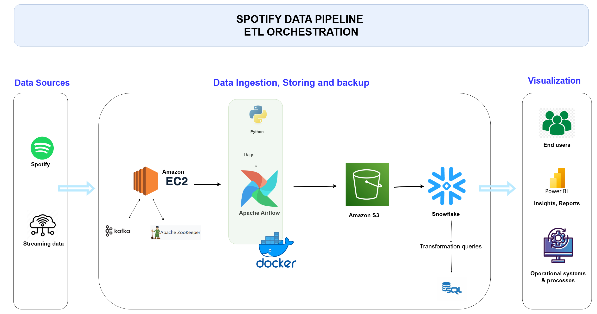

### Spotify Data Pipeline ETL Orchestration

#### **Project Overview**
This project focuses on building a robust data pipeline to extract, transform, and load (ETL) data from Spotify into a data warehouse. The pipeline is designed to handle both batch and streaming data, ensuring that the data is processed efficiently and made available for analysis and visualization.

---

#### **Objective**
The primary objective of this project is to create an automated ETL pipeline that:
1. Extracts data from Spotify's API.
2. Processes and transforms the data using Python scripts.
3. Stores the transformed data in Amazon S3 and Snowflake.
4. Provides insights and reports through Power BI.
5. Orchestrates the entire process using Apache Airflow.

---

#### **Architecture Overview**
The architecture of the Spotify Data Pipeline is depicted in the diagram below:



**Key Components:**
1. **Data Sources:**
   - **Spotify API:** Source of raw data.
   - **Streaming Data:** Real-time data ingestion using Kafka.

2. **Data Ingestion, Storing, and Backup:**
   - **Amazon EC2:** Hosts the ETL processes.
   - **Apache Kafka & ZooKeeper:** Handles real-time data streaming.
   - **Python Scripts:** Perform data extraction and transformation.
   - **Apache Airflow:** Orchestrates the ETL workflow.
   - **Amazon S3:** Temporary storage for raw and intermediate data.
   - **Snowflake:** Data warehouse for storing and querying transformed data.

3. **Visualization:**
   - **Power BI:** Generates insights and reports for end-users.
   - **Operational Systems & Processes:** Uses SQL queries for operational analytics.

---

#### **Project Structure**
The project is organized into several directories and files, as shown in the file structure below:

**Directory Structure:**
```
spotify_data_pipeline/
├── airflow/
│   ├── dags/
│   │   ├── __pycache__/
│   │   ├── sqls/
│   │   │    ├── songs_loading.sql
│   │   ├── data_pipeline.py
│   │   ├── load_data_snowflake.py
│   │   ├── playlist_consumer.py
│   │   └── playlist_producer.py
│   ├── .gitignore
│   ├── cmds.txt
│   ├── docker-compose.yaml
│   ├── Dockerfile
│   ├── etl_architecture.drawio
│   ├── etl_architecture.png
│   ├── playlist_songs_clean.json
│   ├── playlist_tracks.json
│   └── requirements.txt
└── .env
```

**Key Files and Directories:**
- **`airflow/dags/`:** Contains all DAGs (Directed Acyclic Graphs) for Apache Airflow.
  - `data_pipeline.py`: Main ETL pipeline logic.
  - `load_data_snowflake.py`: Script to load data into Snowflake.
  - `playlist_consumer.py`: Consumes playlist data from Kafka.
  - `playlist_producer.py`: Produces playlist data to Kafka.
- **`airflow/sqls/`:** SQL scripts used for data transformations and loading.
- **`.env`:** Environment variables file for sensitive information like API keys and database credentials.
- **`docker-compose.yaml`:** Configuration for running the project in a Docker environment.
- **`Dockerfile`:** Dockerfile for building the containerized environment.
- **`requirements.txt`:** Lists all Python dependencies required for the project.

---

#### **Important Tips**

1. **Configure Environment Variables:**
   Copy `.env.example` to `.env` and update it with your Spotify API credentials, AWS keys, and Snowflake details:
   ```env
   SPOTIFY_CLIENT_ID=your_client_id
   SPOTIFY_CLIENT_SECRET=your_client_secret
   AWS_ACCESS_KEY_ID=your_aws_access_key
   AWS_SECRET_ACCESS_KEY=your_aws_secret_key
   SNOWFLAKE_ACCOUNT=your_snowflake_account
   SNOWFLAKE_USER=your_snowflake_user
   SNOWFLAKE_PASSWORD=your_snowflake_password
   ```

2. **Trigger the ETL Pipeline:**
   - Navigate to the DAGs section in the Airflow UI.
   - Trigger the `data_pipeline` DAG to start the ETL process.

---

#### **Pipeline Workflow**
1. **Extract Data:**
   - The `data_pipeline.py` script extracts data from the Spotify API.
   - Streaming data is ingested using Kafka.

2. **Transform Data:**
   - Python scripts clean and transform the extracted data.
   - Transformation queries are executed in Snowflake.

3. **Load Data:**
   - Transformed data is loaded into Amazon S3 for backup.
   - Final data is loaded into Snowflake for storage and querying.

4. **Visualize Data:**
   - End-users can access insights and reports via Power BI.
   - Operational systems use SQL queries for real-time analytics.

---

#### **Technologies Used**
- **Spotify API:** For extracting music and playlist data.
- **Apache Kafka & ZooKeeper:** For real-time data streaming.
- **Python:** For data extraction, transformation, and orchestration.
- **Apache Airflow:** For orchestrating the ETL pipeline.
- **Amazon S3:** For temporary storage of raw and intermediate data.
- **Snowflake:** For storing and querying the final transformed data.
- **Power BI:** For generating insights and reports.
- **Docker:** For containerizing the application.
- **AWS EC2:** For hosting the ETL processes.

---
- ## 🛡️ License

This project is licensed under the [MIT License](LICENSE). You are free to use, modify, and share this project with proper attribution.

#### **Contact**
For any questions or feedback, please reach out to:

[](https://dev.to/brian_otina_)
[](https://github.com/otinabrayo)
[](mailto:brianotina20@gmail.com)
[](https://t.me/just_otina)
[](https://discord.com/channels/@otina_)

---
Feel free to customize this README further based on additional specifics or requirements of your project!
